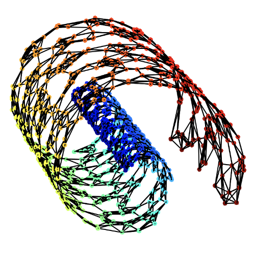

# K Nearest Neighbor (KNN) graph

---

此内容来自CNA作者在Guitub中放的视频链接 https://www.youtube.com/watch?v=FlFYa79D4dc&t=2405s

本视频有2个部分：这里写第一部分介绍KNN的笔记，Meeting部分在讲CNA，所以放到CNA的section里了。

### 1. Curse of dimensionality (维数诅咒)

这个部分给你提供`how KNN helps`的直觉。

Curse of dimensionality(维数诅咒)：Volume of space grows exponentially with # of dimensions, way faster than the corresponding # of observations (# stands for number). 用来描述当（数学）空间维度增加时，体积以指数增加的难题。 

导致的问题是，观察值在稀疏的高维空间中，互相距离显得非常相似，即distribution of distances between uniformly distributed（均匀分布）points in 超立方体[0,1]^d concentrates in a narrow band as d increases. 如图：

在MNIST数据中的例子表明：在高维数据中，distance无法capture到similarity，高维数据中的distance是unintuitive的, point之间的距离非常相似，就算是从非常不同的digit也是如此。

MNIST数据sits on a low-D manifold in 784-D space. Here, the true dimensionality of the data can be much lower than its ambient space（如MNIST的digit数据，或者人脸数据）. 如图：

此时，我们可以用一个graph来离散地表示这个manifold。如图：

### 2. Mechanics of KNN construction and diffusion

定义KNN neighbor graph: 对于每个observation，确定K个距离最近的另外的observation。
我们可以用adjacency matrix来表示KNN，如果是该observation的KNN则为1，否则为0。
同时，可以根据距离对每个edge来赋予权重。从而我们可以得到Affinity matrix（有权重的adjacency matrix）。

（为什么要规定K数，而不是规定distance的threshold来定义neighbors呢？可能是为了让比较远的点也能找到nearest neighbor？）

那么，在t steps中，从node i到node j的概率是多少呢？我们把Affinity matrix转化为Markov transition matrix。

### 3. KNN的应用介绍：数据去噪，低纬度embedding，聚类

### 4. Approximating KNNs with the "annoy" algorithm

---
参考

1. KNN lecture from Cornell university: https://www.cs.cornell.edu/courses/cs4780/2018fa/lectures/lecturenote02_kNN.html
2. Numerical Tours of Data Sciences: http://www.numerical-tours.com/
3. 维数灾难 Wikipedia：https://zh.m.wikipedia.org/zh/%E7%BB%B4%E6%95%B0%E7%81%BE%E9%9A%BE
4. 知乎中关于超立方体的讨论：https://www.zhihu.com/question/27140979